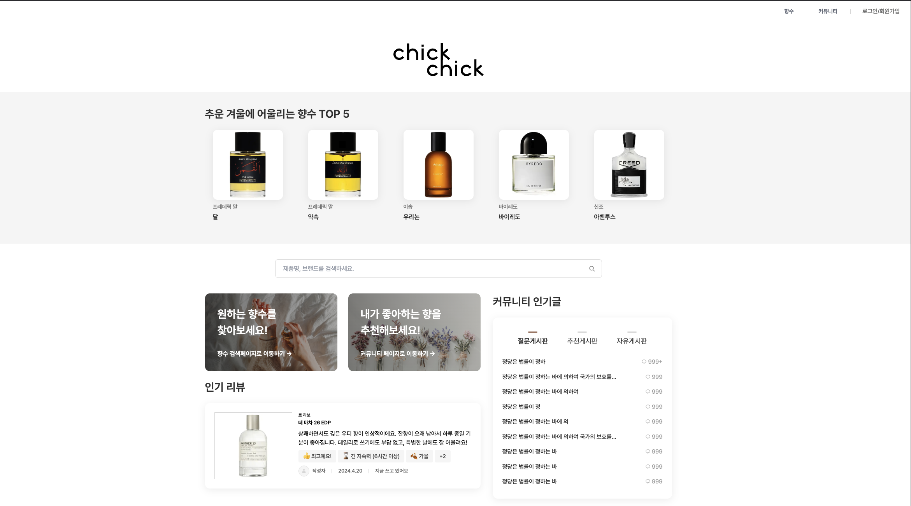

# Perscent 🌸

**Perscent**는 향수 애호가들을 위한 종합 커뮤니티 플랫폼입니다. 향수 리뷰, 추천, 컬렉션 관리 및 커뮤니티 기능을 제공합니다.

## ✨ 주요 기능

### 🔍 향수 탐색 및 검색

- 브랜드별 향수 목록 조회
- 향수 상세 정보 (노트, 어코드, 지속성, 실라주 등)
- 고급 필터링 및 검색 기능

### 📝 리뷰 시스템

- 향수 사용 후기 작성
- 5점 평점 시스템
- 지속성, 실라주, 계절감, 가격 대비 만족도 평가
- 성별 프로필 및 사용 시간대 정보

### 👥 커뮤니티

- 자유게시판, 질문, 추천 게시판
- 향수 관련 게시글 작성 및 댓글
- 게시글 좋아요 및 북마크 기능

### 📚 개인 컬렉션

- 보유 향수 컬렉션 관리
- 북마크 기능
- 사용자 활동 기록

### 🔐 소셜 로그인

- Google, Naver, Kakao 로그인 지원
- NextAuth.js 기반 인증 시스템

## 🛠 기술 스택

### Frontend

- **Framework**: Next.js 15 (App Router)
- **Language**: TypeScript
- **Styling**: Tailwind CSS
- **UI Components**: Custom components with Tailwind
- **State Management**: Zustand
- **Forms**: React Hook Form + Zod validation
- **Rich Text Editor**: CKEditor 5

### Backend

- **API Framework**: Hono
- **Database**: PostgreSQL
- **ORM**: Prisma
- **Authentication**: NextAuth.js
- **File Storage**: Supabase

### Development Tools

- **Package Manager**: Yarn
- **Linting**: ESLint
- **Component Development**: Storybook
- **API Documentation**: OpenAPI/Swagger

## 📦 설치 및 실행

### 필수 요구사항

- Node.js 18+
- PostgreSQL
- Yarn

### 1. 저장소 클론

```bash
git clone <repository-url>
cd chickchick
```

### 2. 의존성 설치

```bash
yarn install
```

### 3. 환경 변수 설정

`.env.local` 파일을 생성하고 다음 변수들을 설정하세요:

```env
# Database
DATABASE_URL="postgresql://..."
DIRECT_URL="postgresql://..."

# NextAuth.js
NEXTAUTH_SECRET="your-secret"
NEXTAUTH_URL="http://localhost:3000"

# OAuth Providers
GOOGLE_CLIENT_ID="your-google-client-id"
GOOGLE_CLIENT_SECRET="your-google-client-secret"
NAVER_CLIENT_ID="your-naver-client-id"
NAVER_CLIENT_SECRET="your-naver-client-secret"
KAKAO_CLIENT_ID="your-kakao-client-id"
KAKAO_CLIENT_SECRET="your-kakao-client-secret"

# Supabase
NEXT_PUBLIC_SUPABASE_URL="your-supabase-url"
NEXT_PUBLIC_SUPABASE_ANON_KEY="your-supabase-anon-key"
```

### 4. 데이터베이스 설정

```bash
# Prisma 스키마 생성
npx prisma generate

# 데이터베이스 마이그레이션
npx prisma migrate deploy
```

### 5. 개발 서버 실행

```bash
yarn dev
```

서버가 실행되면 [http://localhost:3000](http://localhost:3000)에서 애플리케이션을 확인할 수 있습니다.

## 📝 사용 가능한 스크립트

```bash
# 개발 서버 실행
yarn dev

# 프로덕션 빌드
yarn build

# 프로덕션 서버 실행
yarn start

# Storybook 실행
yarn storybook

# Prisma Zod 스키마 생성
yarn zod
```

## 🏗 프로젝트 구조

```
src/
├── app/                    # Next.js App Router
│   ├── (main)/            # 메인 페이지 그룹
│   ├── api/               # API 라우트
│   ├── brand/             # 브랜드 페이지
│   ├── community/         # 커뮤니티 페이지
│   ├── perfumes/          # 향수 상세 페이지
│   └── user/              # 사용자 페이지
├── components/            # 재사용 가능한 컴포넌트
│   ├── commons/           # 공통 컴포넌트
│   ├── domains/           # 도메인별 컴포넌트
│   └── modal/             # 모달 컴포넌트
├── lib/                   # 유틸리티 및 설정
│   ├── hono/              # Hono API 설정
│   ├── prisma/            # Prisma 클라이언트
│   ├── queries/           # 데이터 조회 함수
│   ├── stores/            # Zustand 스토어
│   └── utils/             # 유틸리티 함수
└── stories/               # Storybook 스토리
```

## 🎨 컴포넌트 시스템

프로젝트는 재사용 가능한 컴포넌트 시스템을 갖추고 있습니다:

- **Commons**: 버튼, 입력, 카드 등 기본 UI 컴포넌트
- **Domains**: 특정 도메인(향수, 커뮤니티, 사용자)에 특화된 컴포넌트
- **Modal**: 로그인, 리뷰 등 모달 컴포넌트

모든 컴포넌트는 Storybook으로 문서화되어 있으며, `yarn storybook`으로 확인할 수 있습니다.

## 📊 데이터베이스 스키마

주요 엔티티:

- **User**: 사용자 정보
- **Perfume**: 향수 정보
- **Brand**: 브랜드 정보
- **Review**: 향수 리뷰
- **Post**: 커뮤니티 게시글
- **Comment**: 댓글
- **Bookmark**: 북마크 (향수/게시글)
- **Collection**: 사용자 향수 컬렉션

자세한 스키마는 `prisma/schema.prisma` 파일을 참조하세요.

## 🔧 API 문서

개발 모드에서 API 문서는 다음 URL에서 확인할 수 있습니다:

- OpenAPI 스펙: `http://localhost:3000/api/doc`

API는 다음과 같은 엔드포인트를 제공합니다:

- `/api/v1/perfumes` - 향수 관련 API
- `/api/v1/community` - 커뮤니티 API
- `/api/v1/reviews` - 리뷰 API
- `/api/v1/users` - 사용자 API
- `/api/v1/search` - 검색 API

## 📸 미리보기



## 💡 기술적 도전 포인트

• App Router 전환: 페이지 라우팅 및 서버 컴포넌트 기반 성능 개선.
• 상태 관리 전략: Zustand + React Query 기반 데이터 관리.
• 컴포넌트 문서화: Storybook으로 UI 테스트 및 관리.

## 📆 개발 로드맵

    •	향수 추천 알고리즘 추가
    •	다국어 지원 (i18n)
    •	모바일 최적화 개선

## 🤝 팀 협업 & 코드 컨벤션

• GitHub Actions + PR 리뷰 프로세스.
• ESLint + Prettier를 통한 일관성 유지.
