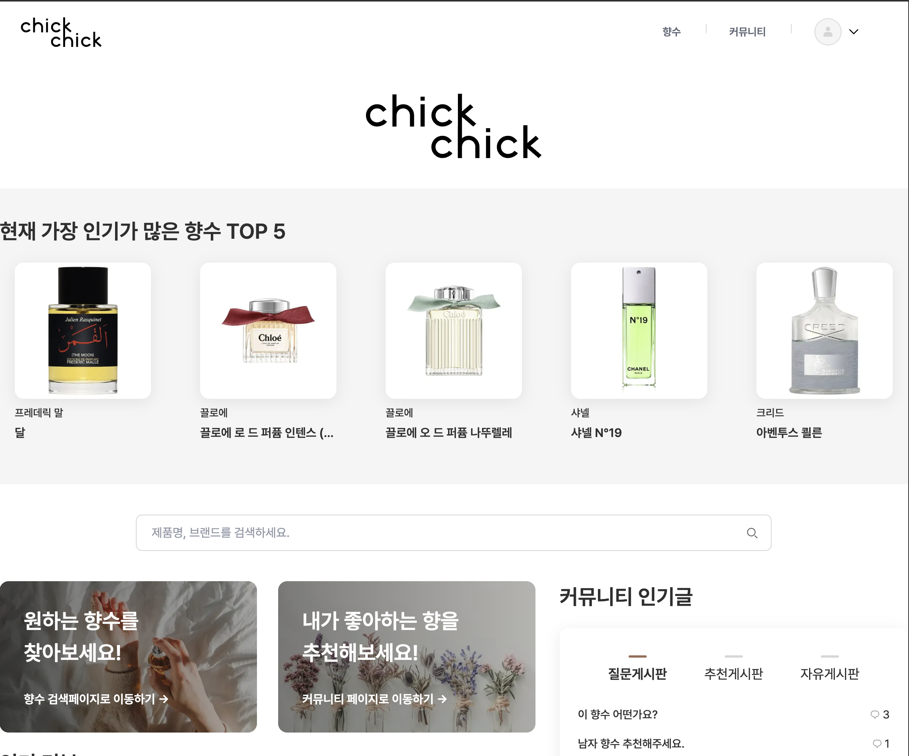
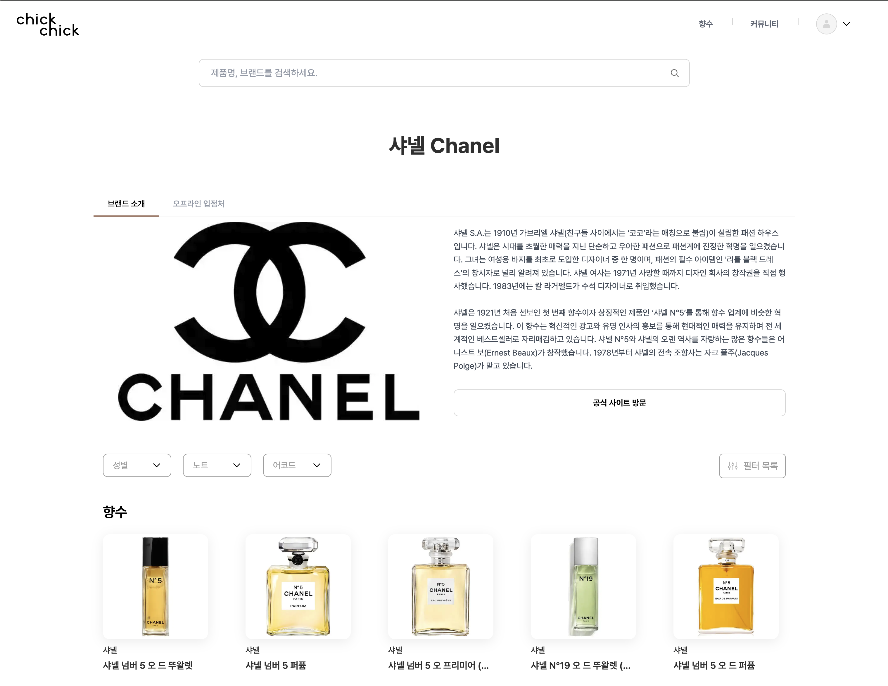

# ChickChick 🌸

향수 정보 조회, 리뷰, 커뮤니티 기능을 제공하는 웹 애플리케이션.
Next.js 15 App Router와 Hono를 기반으로 구현한 풀스택 프로젝트.

---

## 🖼 미리보기

<table>
  <tr>
    <td></td>
    <td></td>
  </tr>
</table>

---

## ✨ 구현된 기능

### 사용자

- Google, Kakao 소셜 로그인 (NextAuth.js v5)
- 사용자 프로필 및 활동 내역

### 향수

- 브랜드별 향수 목록 조회
- 향수 상세 정보 (노트, 어코드, 지속성, 실라주 등)
- 향수 검색 및 다중 필터링

### 리뷰

- 5점 평점 및 세부 평가 (지속성, 실라주, 계절감, 가격 대비 만족도)
- 성별 및 사용 시간대 정보 포함
- Tiptap 기반 에디터

### 커뮤니티

- 게시판 (자유/질문/추천)
- 댓글 및 좋아요
- 이미지 업로드 (Supabase Storage)

### 개인 활동

- 향수/게시글 북마크
- 개인 향수 컬렉션 관리
- 임시저장

---

## 🛠 기술 스택

**Frontend**  
Next.js 15 (App Router) · TypeScript · Tailwind CSS · Zustand · TanStack Query · React Hook Form · Zod · Tiptap

**Backend**  
Hono · Prisma · PostgreSQL · NextAuth.js v5 · Supabase Storage

**Infra**  
Vercel · Yarn

---

## 🎯 주요 기술적 선택

### Hono on Next.js

Next.js API Routes 대신 Hono를 도입했습니다. App Router의 폴더 기반 라우팅 방식은
엔드포인트가 늘어날수록 파일과 폴더가 분산되어 전체 API 구조를 한눈에 파악하기 어렵다는
한계를 느꼈습니다. 캐치올 세그먼트(`/api/[[...route]]`)를 활용해 Hono로 모든 요청을
중앙에서 라우팅하도록 구성하여 API 구조의 응집도를 높였습니다.

### 상태 관리 분리

- **Zustand**: 세션 정보, UI 상태(모달, 토글 등)
- **TanStack Query**: 서버 상태 (API 응답 캐싱 및 재검증)

서버 상태와 클라이언트 상태의 책임을 명확히 분리하여 관리합니다.

---

## 📦 로컬 실행

### 요구사항

- Node.js 22+
- PostgreSQL
- Yarn

### 설치

### 1. 저장소 클론

```bash
git clone <repository-url>
cd chickchick
```

### 2. 의존성 설치

```bash
yarn install
```

### 3. 환경 변수 설정

`.env.local` 파일을 생성하고 다음 변수들을 설정하세요:

```env
# Supabase
NEXT_PUBLIC_SUPABASE_URL="your-supabase-url"
NEXT_PUBLIC_SUPABASE_ANON_KEY="your-supabase-anon-key"
SUPABASE_SERVICE_ROLE_KEY="your-supabase-service-role-key"

# OAuth Providers
GOOGLE_CLIENT_ID="your-google-client-id"
GOOGLE_CLIENT_SECRET="your-google-client-secret"
NAVER_CLIENT_ID="your-naver-client-id"
NAVER_CLIENT_SECRET="your-naver-client-secret"
KAKAO_CLIENT_ID="your-kakao-client-id"
KAKAO_CLIENT_SECRET="your-kakao-client-secret"
NEXT_PUBLIC_KAKAO_JAVASCRIPT_KEY="your-kakao-javascript-key"
KAKAO_REST_KEY="your-kakao-rest-key"

# Auth (NextAuth.js v5)
AUTH_SECRET="your-auth-secret"
AUTH_TRUST_HOST=true
AUTH_URL="http://localhost:3000"

# Internal
# NextAuth가 OAuth 로그인 시 유저 동기화를 위해 내부 API(/api/v1/auth/sync)를 호출할 때
# 외부 요청과 구분하기 위해 x-internal-secret 헤더에 실어 보내는 시크릿 키입니다.
INTERNAL_API_SECRET="your-internal-api-secret"
```

---

## 🗂 프로젝트 구조

```
src/
├── app/                        # Next.js App Router
│   ├── (main)/                # 메인 페이지
│   ├── api/[[...route]]/      # Hono 캐치올 API 라우트
│   ├── api/auth/              # NextAuth.js 인증 라우트
│   ├── api-doc/               # OpenAPI 문서 페이지
│   ├── brand/[name]/          # 브랜드 상세 페이지
│   ├── community/             # 커뮤니티 목록
│   ├── community/post/        # 게시글 작성·상세·수정
│   ├── perfumes/              # 향수 목록 및 상세
│   └── user/[id]/             # 사용자 프로필·활동·북마크·컬렉션
├── components/                # UI 컴포넌트
│   ├── commons/               # 공통 컴포넌트 (버튼, 카드, 탭 등)
│   ├── domains/               # 도메인별 컴포넌트
│   │   ├── brandDetail/
│   │   ├── community/
│   │   ├── main/
│   │   ├── perfumeDetail/
│   │   ├── perfumes/
│   │   ├── post/
│   │   ├── postDetail/
│   │   └── user/
│   └── modal/                 # 모달 컴포넌트
├── server/                    # 서버 사이드 코드
│   ├── hono/                  # Hono API 레이어
│   │   ├── middleware/        # 인증 미들웨어
│   │   ├── repositories/      # DB 접근 레이어
│   │   ├── routes/v1/         # 핸들러 (도메인별 라우트)
│   │   ├── schemas/           # Zod 요청/응답 스키마
│   │   ├── services/          # 비즈니스 로직
│   │   └── utils/             # 서버 유틸리티
│   ├── database/              # 서버 액션 및 세션 조회
│   ├── prisma/                # Prisma 클라이언트
│   └── supabase/              # Supabase 클라이언트
├── client/                    # 클라이언트 사이드 코드
│   ├── hooks/query/           # TanStack Query 훅
│   ├── stores/                # Zustand 스토어
│   ├── tiptap/                # Tiptap 에디터 설정
│   └── utils/                 # 클라이언트 유틸리티
└── shared/                    # 서버·클라이언트 공용
    ├── constants/             # 공통 상수
    ├── types/                 # 공통 타입 정의
    └── utils/                 # 공통 유틸리티
```

---
